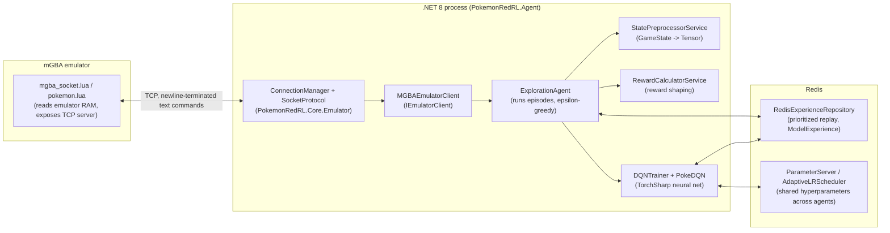

# Copilot Instructions — PokemonRedRL

These are repository-wide custom instructions for GitHub Copilot / AI coding agents working in this repo. Read this before making changes.

## What this project is

PokemonRedRL trains a Reinforcement Learning (DQN) agent to play **Pokémon Red** through the **mGBA** emulator. A Lua script running inside mGBA exposes game memory over a TCP socket; a .NET 8 application reads game state, decides actions, executes them back through the socket, and trains a neural network (TorchSharp) from the resulting experience, persisted in Redis.

Multiple `ExplorationAgent` instances can run concurrently (see `NUMBER_OF_AGENTS` in `Program.cs`), each talking to its own mGBA instance/port, sharing experience and hyperparameters through Redis.

## Solution / project layout

Root solution: [src/PokemonRedRL.sln](../src/PokemonRedRL.sln)

| Project | Responsibility |
|---|---|
| `PokemonRedRL.Agent` | Entry point (`Program.cs`), DI composition root, `ExplorationAgent` (episode loop, epsilon-greedy action selection, experience creation) |
| `PokemonRedRL.Core` | Emulator I/O: `ConnectionManager` (TCP connect/retry), `SocketProtocol` (command/response framing), `MGBAEmulatorClient` (`IEmulatorClient`), `ActionExecutor`, `NetworkConfig(Factory)`, `RewardCalculatorService`, `StatePreprocessorService` |
| `PokemonRedRL.Models` | RL core: `PokeDQN` (TorchSharp `Module`, 3-layer MLP), `DQNTrainer` (training step, action selection, TD-error/priority updates), `AdaptiveLRScheduler`, `ExperienceReplay`, `SumTree` (prioritized replay), `ParameterServer`, `RedisExperienceRepository` (`IExperienceRepository`), `RedisMaintenanceService`, `RedisConfig` |
| `PokemonRedRL.DAL` | Plain data models: `GameState`, `GameStateResponse`, `PokemonData` |
| `PokemonRedRL.Utils` | Cross-cutting helpers: `Enums` (`Buttons`, `ActionType`), `GameStateSerializer`, `TensorExtensions` |
| `src/scripts/mgba_socket.lua`, `src/mGBA-0.10.5-win64/scripts/*.lua` | Lua side of the bridge, loaded inside mGBA (`pokemon.lua` reads party/species/memory, `mgba_socket.lua` runs the socket server) |
| `src/data/` | ROMs, save states, and JSON metadata (`events_data.json`, `map_data.json`) used by the emulator/agent |
| `programs/` | Third-party installers/archives (Lua, LuaRocks, luasocket, mGBA, TDM-GCC) used to set up the local environment — not project source |

A full, generated file-by-file map lives in [docs/CODEBASE_MAP.md](../docs/CODEBASE_MAP.md). **Regenerate it (via the `/cartograph` prompt) whenever you add, remove, or move files/projects** — do not let it go stale.

A narrative "what/why" companion doc — motivation, RL approach, design tradeoffs, and known gaps/inconsistencies — lives in [docs/PROJECT_OVERVIEW.md](../docs/PROJECT_OVERVIEW.md). Read it before making non-trivial changes; update it if you discover a new design-level inconsistency or resolve a listed one.

Each non-trivial task gets a committed plan file at `docs/tasks/<slug>.md` (created by `/plan-task`, updated through `/review-plan` → `/implement-task` → `/review-changes` → `/commit-changes`, tracking a `Status:` field and a step checklist). These are kept in the repo as a durable record of what was planned and done — do not delete or gitignore `docs/tasks/`.

## Conventions actually used in this codebase

- Target framework: **.NET 10.0**, `Nullable` and `ImplicitUsings` enabled in every `.csproj`.
- Dependency injection via `Microsoft.Extensions.Hosting` `Host.CreateDefaultBuilder` in `Program.cs`. New services should be registered there, following the existing `AddSingleton`/`AddScoped` pattern (services that hold per-agent/per-connection state are `Scoped`; shared infra like `ParameterServer`, `AdaptiveLRScheduler` are `Singleton`).
- Interfaces live in an `Interfaces/` folder next to the code they abstract (`IEmulatorClient`, `IRewardCalculatorService`, `IStatePreprocessorService`, `IExperienceRepository`) and are implemented in a sibling `Services/`/`Emulator/` folder.
- TorchSharp is used directly (`static TorchSharp.torch`, `TorchSharp.Modules`); tensors are created/disposed manually — watch for tensor leaks when editing training code (wrap in `using`/`DisposeScope` where reasonable instead of introducing new leaks).
- The emulator protocol is a simple newline-terminated text command/response over a raw `TcpClient` (`SocketProtocol.SendCommand`). Any new command must be handled on both the C# side and the Lua side.
- Existing code comments/log messages are a mix of Russian and English (the author's working language). Match the surrounding file's language when editing an existing block; new files/comments should default to concise English unless the user asks otherwise.
- No automated test project currently exists in the solution. If you add meaningful logic, prefer adding a test project (`xUnit`, matching `net10.0`) rather than skipping verification.
- `src/data/roms/` (ROMs, `.sav`/`.ss*` save states) and model backups under `src/data/models/` are **intentionally committed** to this repo as working backups — do not add them to `.gitignore` or untrack them without explicit user confirmation.

## Build & run

- Requires: .NET 10 SDK, a running Redis instance on `localhost:6379` (hardcoded in `Program.cs`/`RedisConfig`), mGBA 0.10.5 with `mgba_socket.lua` loaded against a Pokémon Red/FireRed ROM.
- Build: `dotnet build src/PokemonRedRL.sln`
- Run the agent: `dotnet run --project src/PokemonRedRL.Agent`
- There is currently no CI workflow in `.github/` — builds/tests are run locally.

## Agentic workflow for this repo

For any non-trivial task, follow this pipeline using the prompt skills in [.github/prompts](./prompts):

1. **`/plan-task`** — turn the request into a concrete, ordered implementation plan.
2. **`/review-plan`** — critically re-review that plan for gaps, missing edge cases, risky/irreversible steps, before writing code.
3. **`/implement-task`** — execute the reviewed plan step by step, keeping the todo list updated.
4. **`/review-changes`** — verify the diff: build, check for regressions/leaks/security issues, confirm it matches the plan and update `docs/CODEBASE_MAP.md` if structure changed.
5. **`/commit-changes`** — only after review passes, stage and commit (push only with explicit user confirmation).

Do not skip straight to implementation for multi-step or architecturally-risky changes — run the plan/review steps first.
